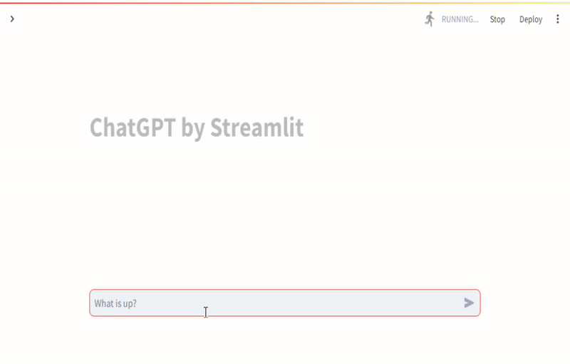

# streamlit-claude-chat

Streamlit LLM Chat App by anthropic claude



## git clone

```
git clone https://github.com/festiva1300/streamlit-claude-chat.git
cd streamlit-claude-chat
```

## environment setting

Write the Anthripic access key, the model to be used in the `.env` file.

```
API_KEY=XX-XXXXX...
AI_MODEL=claude-3-sonnet-20240229
```

## execute

### build a container

```bash
docker build ./ -t streamlit-claude-chat
```

### deploy on local

```bash
docker compose up -d
```

